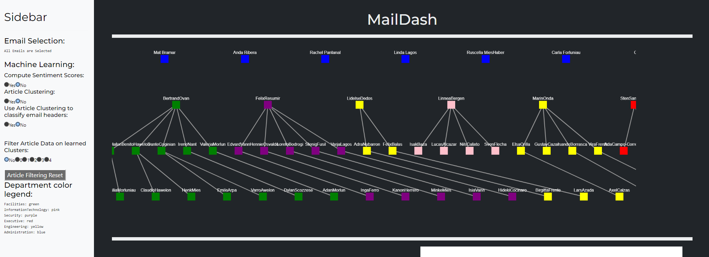
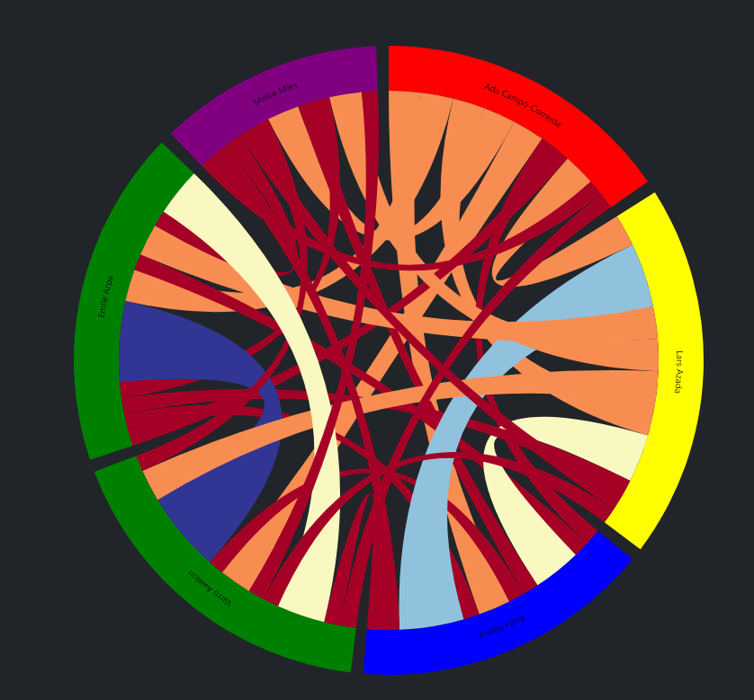
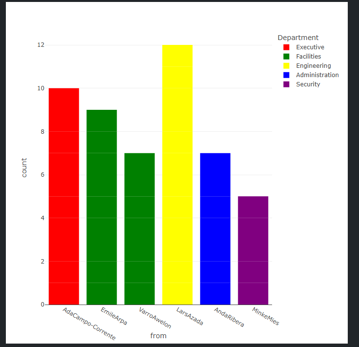
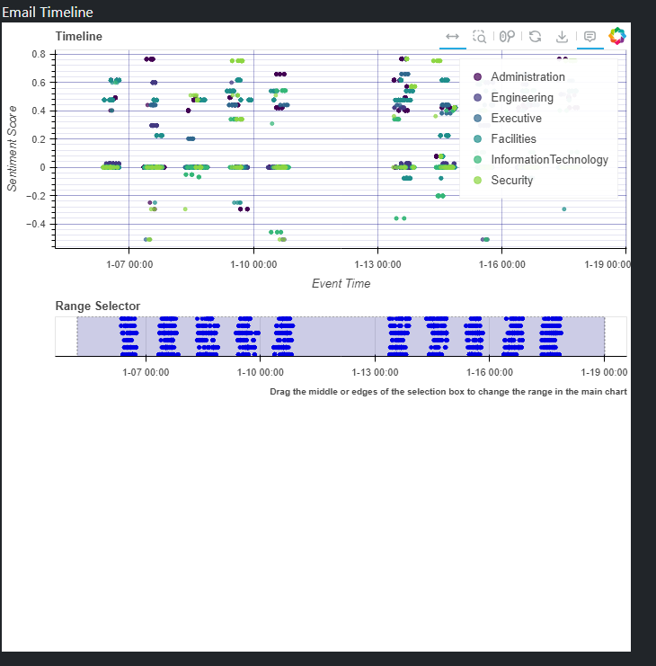
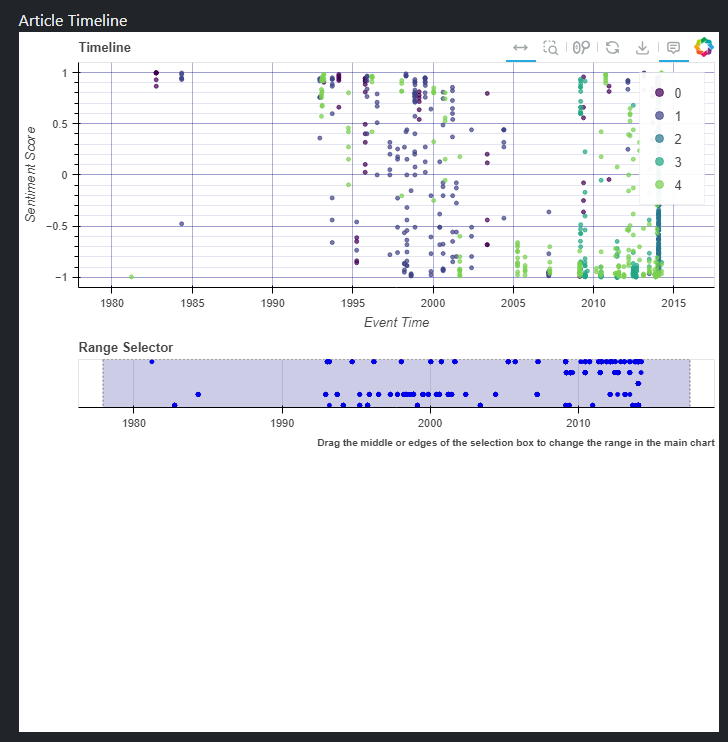

<div align="center">
    MailDash 
</div>


<!-- PROJECT LOGO -->
<br />
<div align="center">

  <p align="center">
    A VA tool for email correspondence and article analytics
  </p>
</div>


<!-- TABLE OF CONTENTS -->
<details>
  <summary>Table of Contents</summary>
  <ol>
    <li>
      <a href="#about-the-project">About The Project</a>
      <ul>
        <li><a href="#built-with">Built With</a></li>
      </ul>
    </li>
    <li>
      <a href="#getting-started">Getting Started</a>
      <ul>
        <li><a href="#prerequisites">Prerequisites</a></li>
        <li><a href="#installation">Installation</a></li>
      </ul>
    </li>
    <li><a href="#usage">Usage</a></li>
    <li><a href="#roadmap">Roadmap</a></li>
    <li><a href="#contributing">Contributing</a></li>
    <li><a href="#license">License</a></li>
    <li><a href="#contact">Contact</a></li>
    <li><a href="#acknowledgments">Acknowledgments</a></li>
  </ol>
</details>


<!-- ABOUT THE PROJECT -->
## About The Project

This project is made for the TU/e Course Visual Analytics 2AMV10. 

It focuses on the 2014 IEEE Visual Analytics Science and Technology (VAST) Challenge (see the data/ directory to view the data used, note that this project focuses on the email and article data).

<p align="right">(<a href="#readme-top">back to top</a>)</p>


### Built With

Below is a list of the main frameworks/libraries used to bootstrap the project:

* Plotly Dash 
* MSTIC
* VADER
* Scikit-Learn

<p align="right">(<a href="#readme-top">back to top</a>)</p>


<!-- GETTING STARTED -->
## Getting Started
The App is built using a Windows operating system and Python 3.10.2. However, it can run on Linux based environments and with newer versions of Python that are compatible with the other dependencies. 

### Prerequisites

Below is a list of the major dependencies and software packages needed to run the app:
* scikit-learn
  ```sh
  python -m pip install scikit-learn
  ```
* pandas
  ```sh
  python -m pip install pandas
  ```
* msticpy
  ```sh
  python -m pip install msticpy 
  ```
* vader
  ```sh
  python -m pip install vader-sentiment
  ```
* dash
  ```sh
  python -m pip install dash
  ```

Other dependencies and quality-of-life software packages are listed in `requirements.txt`.
To install:

```sh
python -m pip install -r requirements.txt
```


### Installation

_Below is an example of how you can instruct your audience on installing and setting up the app._

1. Make sure you have Python and an IDE of choice downloaded with a virtual enviroment containing all the prerequisites. 
2. Clone the repo - change name and username accordingly
   ```sh
   git clone https://github.com/github_username/repo_name.git
   ```
3. Change git remote url to avoid accidental pushes to base project
   ```sh
   git remote set-url origin github_username/repo_name
   git remote -v # confirm the changes
   ```

<p align="right">(<a href="#readme-top">back to top</a>)</p>


<!-- USAGE EXAMPLES -->
## Usage

To run the app, make sure to run the all cells in the preprocessing.ipynb file to create the needed data files which, if correctly executed will show up in the modified_data/ directory. 

To run the app, run the main script (app.py):
```
python app.py
```

The app will be automatically hosted on a localhost, which will be listed in the python terminal.

Additionally, the app can be run inside a jupyter notebook (app.ipynb). This does not have our preference as the formatting will be off. 

## Usage of the app
# Starting View and SideBar 

When the opens this is the starting view, with the sidebar on the right and main content to its left. 
The Sidebar holds several user machine learning options, displays the current data selection and some (additional) machine learning results as well as a color legend.





### Org Chart
From the organizational data, the app creates a organization (hierarchy) chart (see image in above section), which is color coded per department. This plot is interactive: by clicking on the people the email related plots are changed. Crtl + click to select multiple people. 

### Chord Diagram
The chord diagram portrays the email correspondence between the people. Every line (or chord) represents one email, emails from and to the same people are bundled. By hovering over a chord, it shows the amount of emails person A has sent to person B.  



### Email Distribution
This plot portrays the email's sent distribution per person. It is color coded per department, however, when clustering (from the ML tools) is enabled it is color coded per cluster.
The plot is interactive, hovering over individual messages shows the message's details.  



### Email Timeline 
This plot shows the email timeline, grouped per person. When sentiment analysis is activated, the y-axis will protray the sentiment of the message. When clustering is acivated for the email, the emails are color coded per cluster. The plot is interactive, hovering over individual messages shows the message's details, additionally, the time range of the timeline can be set. 



### Article Timeline
This plot shows the email timeline, grouped per medium. When sentiment analysis is activated, the y-axis will protray the sentiment of the article. When clustering is acivated, the articles are color coded per cluster. The plot is interactive, hovering over individual messages shows the message's details, additionally, the time range of the timeline can be set. 



### Machine Learning
The app has two main machine learning features: sentiment analyis and clustering. 

1. The articles and messages are classified on a 0-1 sentiment scale, with 0 being negative sentiment and 1 positive sentiment. For this analysis we make use of the VADER sentiment libary. Sentiment analysis can be activated in the sidebar. 

2. Clustering is done by vectorizing all words in every article, then reducing the dimensionality of the vecorization output and then clustering the articles based on the k-means algorithm. When the clustering is done, in the sidebar, the most representative words for each cluster are shown. Additionally there is the option to use the created clusters from the articles to classify the email subjects. Learning a clusterization over the email subjects itself is not possible due to lack of words/data. Clustering can be activated in the sidebar. 

Additionally, after article clusterig there is a filtering option to filter the article data on a specific cluster. This resets the user input on clustering, so, this means that it is possible to iterativley create clusters and filter on them. Moreover, to reset this article fitlering there is a reset button in the sidebar. 


<p align="right">(<a href="#readme-top">back to top</a>)</p>


<!-- LICENSE -->
## License

Distributed under the MIT License. See `LICENSE.txt` for more information.

<p align="right">(<a href="#readme-top">back to top</a>)</p>


<!-- CONTACT -->
## Contact

j.h.a.peeters@student.tue.nl 
jessse.peeters@gmail.com


<p align="right">(<a href="#readme-top">back to top</a>)</p>


